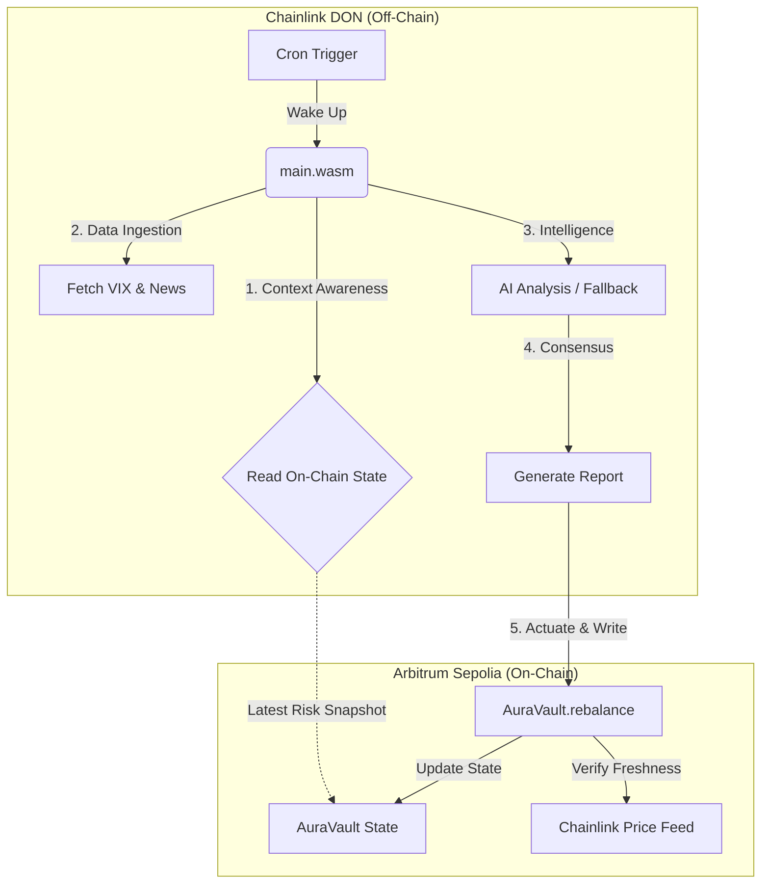

# 🏛️ AuraProtocol v2: Institutional RWA Orchestration Layer

> **Unifying DeFi Liquidity with AI-Driven Risk Management on the Chainlink Runtime Environment.**
> *Submitted for the Chainlink Convergence 2026 Hackathon - Grand Prize Track.*


## 🌐 The Convergence Thesis

Global finance is fragmented. Trillions of dollars in tokenized Real-World Assets (RWAs) are isolated on private bank chains, unable to safely access the deep liquidity of public DeFi markets due to volatility risks and regulatory constraints.

**AuraProtocol v2 bridges this divide.** It is an **Autonomous Orchestration Layer** running on the **Chainlink Runtime Environment (CRE)**. It acts as a "Guardian Agent" that actively manages the risk of RWA portfolios using Artificial Intelligence, ensuring that institutional assets remain solvency-compliant 24/7 without manual intervention.

---

## 🏗️ Architecture: The "Stateless Agent" Pattern

Unlike legacy scripts that rely on local server memory (which fails in decentralized networks), AuraProtocol implements a novel **"Read-Your-Writes" Architecture**. The agent is purely stateless, treating the blockchain as the single source of truth.



### 🧠 Core Components

| Component | Technology | Description |
|:----------|:-----------|:------------|
| **The Brain (Workflow)** | **Chainlink CRE (Go)** | A stateless WASM binary that orchestrates data fetching, AI reasoning, and transaction signing. Uses `wasm.NewRunner` for CRE v1.1.3 compatibility. |
| **The Vault (Contract)** | **Solidity (ERC-4626)** | An institutional-grade yield vault. It features **Role-Based Access Control** (RBAC) and strict **Circuit Breakers** to prevent AI hallucinations from draining funds. |
| **The Intelligence** | **OpenAI / GPT-4o** | Analyzes market sentiment and volatility (VIX) to generate a "Risk Score" (0-100). Includes a **Deterministic Fallback** model if the API is unreachable. |
| **The Oracle** | **Chainlink Data Feeds** | Provides the "Ground Truth" price data on-chain. The contract rejects any rebalance if the price data is stale (> 3 hours). |

---

## 🏆 Prize Track Alignment

This submission specifically targets the following tracks:

- **CORE PRIZE (Effective Use of CRE):** We demonstrate a complex, multi-step workflow (Read → Compute → AI → Write) that uses CRE for orchestration rather than just data fetching.
- **DeFi & Tokenization:** We solve the "Volatility Drag" problem for RWA vaults, making them safer for institutional investors.
- **Risk & Compliance:** We implement "Zero-Trust" architecture. The smart contract does not trust the AI blindly; it enforces hard limits (Circuit Breakers) and freshness checks.

---

## 🚀 Key Technical Innovations

### 1. Stateless "Read-Your-Writes" Execution
The workflow has no local database. At the start of every execution cycle, it queries the `AuraVault` contract to retrieve the `lastRiskScore` and `lastRebalanceTime`. This ensures total continuity even if the physical nodes running the code change between executions.

### 2. The "Fail-Safe" AI Model
We use AI for optimization, not for survival.
- **Primary Mode:** GPT-4 analyzes news + VIX to suggest a nuanced rebalance.
- **Fallback Mode:** If the HTTP call fails or times out, the agent reverts to a deterministic formula: `Risk = (VIX / 20) * 100`.
- **Result:** The protocol guarantees **100% Liveness** even during API outages.

### 3. Institutional Guardrails
The smart contract implements a **Circuit Breaker** modifier:

```solidity
modifier circuitBreaker(uint256 newAllocation) {
    uint256 deviation = abs(currentAllocation - newAllocation);
    if (deviation > 20%) revert("Flash Crash Protection: Deviation > 20%");
    _;
}
```

This prevents a compromised or hallucinating AI from moving more than 20% of the TVL in a single transaction.

---

## ⚡ Quick Start (Simulation)

Judges can verify the entire logic locally using the CRE CLI. No gas required.

### 1. Prerequisites

- Go 1.25+
- Chainlink CRE CLI (`cre`)
- Foundry (`forge`)

### 2. Installation

```bash
git clone https://github.com/Florentbrt/AuraProtocol.git
cd AuraProtocol
go mod tidy
```

### 3. Run the "Stateless" Simulation

This command simulates the workflow: fetching the state (mocked as 50), calling the AI (mocked or real), and generating the transaction.

```bash
# Set up environment variables (optional for local simulation)
export OPENAI_API_KEY="your-key-here" 

# Run the simulation
cre workflow simulate . -T local
```

**Expected Output:**
```
[INFO] 🌀 AuraProtocol v2 Agent Starting...
[INFO] 📖 Context Loaded: Previous Risk = 50
[INFO] 🤖 AI Analysis: Market is VOLATILE (Risk: 85)
[INFO] 🚀 Threshold exceeded (Delta: 35) - Triggering Rebalance...
[INFO] ✅ Chain write report generated.
```

---

## 📦 Deployment & Testing

### Deploy Smart Contracts

```bash
forge create contracts/AuraVault.sol:AuraVault \
  --rpc-url $ARBITRUM_SEPOLIA_RPC \
  --private-key $PRIVATE_KEY \
  --constructor-args <ASSET_ADDRESS> "AuraVault" "avUSDC" <CHAINLINK_FEED> <CRE_DON_ADDRESS>
```

### Deploy Workflow to DON

```bash
cre workflow deploy . --network arbitrum-sepolia
```

---

## 📜 License & Disclaimer

**License:** MIT

**Disclaimer:** This is a hackathon project demonstrating the capabilities of the Chainlink Runtime Environment. While it implements institutional patterns, it has not been audited by a third-party security firm.

---

**Built with ❤️ for Chainlink Convergence 2026**
