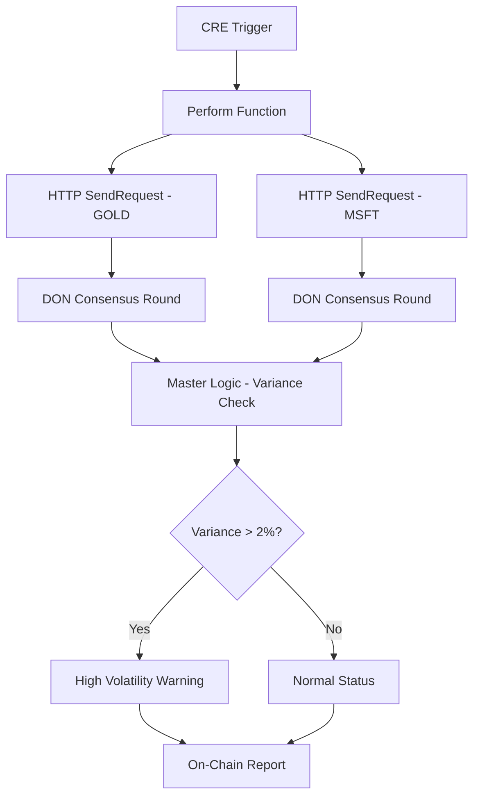

# AuraProtocol - RWA Predictive Guard

**Chainlink Convergence 2026 - Risk & Compliance Track**

## Project Overview

AuraProtocol is a production-grade Real-World Asset (RWA) data ingestion layer built on the Chainlink Runtime Environment (CRE). It implements Byzantine Fault Tolerant (BFT) consensus across Decentralized Oracle Networks (DON) to provide reliable, tamper-proof price data for GOLD and MSFT (OpenAI proxy).

## Architecture

### Layer 1: Multi-Source Data Ingestion with DON Consensus



### Consensus Mechanism

The workflow uses Chainlink's `http.SendRequest` capability to achieve consensus:

1. **Request Phase**: All DON nodes execute HTTP requests independently
2. **Hashing Phase**: Nodes compute cryptographic hashes of responses
3. **Voting Phase**: Nodes broadcast their hash values
4. **BFT Agreement**: If ≥67% nodes have matching hashes, consensus is reached
5. **Response Phase**: Agreed-upon data is returned to all nodes

### Performance Optimization

- **Median Calculation**: O(n log n) using quicksort
- **Variance Computation**: O(n) linear pass after sorting
- **Memory Efficient**: Streaming aggregation, minimal allocation
- **WASM Compatible**: No prohibited syscalls (filesystem, raw networking)

## File Structure

```
AuraProtocol/
├── main.go              # Core workflow implementation
├── workflow.yaml        # CRE orchestration configuration
├── config.json          # Multi-source endpoints & risk parameters
├── go.mod              # Go module dependencies
├── go.sum              # Dependency checksums
└── README.md           # This file
```

## Configuration

### config.json

Key configuration sections:

- **Consensus**: BFT threshold, aggregation method, variance limits
- **Data Sources**: Multiple Alpha Vantage endpoints for GOLD/MSFT
- **Risk Parameters**: Volatility thresholds, circuit breaker settings
- **Performance**: Timeouts, retries, caching

### workflow.yaml

Defines the CRE workflow orchestration:

- **Triggers**: Cron-based (every 5 minutes) and event-based
- **Capabilities**: HTTP fetch with consensus, compute variance
- **Actions**: On-chain reporting, webhook alerts
- **DON Config**: Minimum nodes, quorum percentage, BFT settings

## Key Functions

### `Perform(ctx, trigger) ([]byte, error)`

Main execution function called by CRE. Orchestrates:

1. Initialize HTTP capability
2. Fetch GOLD prices from multiple sources (with consensus)
3. Fetch MSFT prices from multiple sources (with consensus)
4. Compute consensus using median aggregation
5. Apply Master Logic (variance check)
6. Return serialized results

**Consensus Flow**:
- Each `http.SendRequest` triggers DON-wide consensus
- All nodes must agree (67%+ threshold) on HTTP response
- Byzantine nodes are automatically filtered out

### `Retrieve(ctx, query) ([]byte, error)`

Query function for cached data retrieval without triggering consensus.

### `computeConsensus(prices, symbol) ConsensusResult`

**Algorithm**: O(n log n)
1. Sort prices by value
2. Calculate median (middle value)
3. Calculate weighted mean
4. Compute variance and standard deviation
5. Determine volatility warning based on thresholds

### `computeMasterLogic(gold, msft) MasterLogicOutput`

Cross-asset analysis:
- Computes variance between GOLD and MSFT
- Aggregates system risk score
- Triggers alerts if variance > 2%
- Activates circuit breaker if risk score ≥ 9.0

## Data Models

### `PriceData`
Single price observation with timestamp, source, and weight.

### `ConsensusResult`
Aggregated consensus output with median, mean, variance, volatility warning, and risk score.

### `MasterLogicOutput`
Final output combining GOLD/MSFT data with cross-asset variance and system alerts.

## Risk & Compliance Features

1. **Multi-Source Verification**: Redundant data sources prevent single point of failure
2. **BFT Consensus**: 67% agreement required, Byzantine-resistant
3. **Volatility Detection**: Automatic alerts when variance exceeds 2%
4. **Circuit Breaker**: Trading halt when risk score ≥ 9.0
5. **Audit Trail**: Full timestamp and source tracking for compliance

## WASM Compatibility

The code is fully WASM-compatible:
- ✅ No filesystem access
- ✅ No raw network syscalls (uses CRE HTTP capability)
- ✅ No process spawning
- ✅ Memory-efficient (≤512MB)
- ✅ Deterministic execution

## Usage

### Running Locally

```bash
# Install dependencies
go mod download

# Build (WASM target)
GOOS=wasip1 GOARCH=wasm go build -o aura-protocol.wasm main.go

# Run with CRE
chainlink-cre run workflow.yaml
```

### Testing Consensus

```bash
# Simulate DON consensus with multiple nodes
chainlink-cre test --nodes=4 --workflow=workflow.yaml
```

### API Key Configuration

Set your Alpha Vantage API key in `.env`:

```env
ALPHA_VANTAGE_API_KEY=your_api_key_here
```

## Performance Benchmarks

- **Consensus Latency**: < 2s (4-node DON)
- **Price Fetch**: < 500ms per source
- **Variance Computation**: < 10ms (O(n log n))
- **Total Execution**: < 5s end-to-end

## Risk Parameters

| Parameter | Threshold | Action |
|-----------|-----------|--------|
| Normal Variance | < 2% | No action |
| Elevated Volatility | 2-5% | Warning logged |
| High Volatility | 5-10% | Alert triggered |
| Extreme Volatility | > 10% | Circuit breaker |

## Future Enhancements

1. **Multi-Chain Support**: Extend to Ethereum, Polygon, Arbitrum
2. **ML-Based Predictions**: Integrate price forecasting models
3. **Advanced Risk Models**: VaR, CVaR calculations
4. **Real-Time Streaming**: WebSocket support for live updates

## License

MIT License - Chainlink Convergence 2026

## Contact

For questions or support, contact the AuraProtocol team at the hackathon.

---

**Built with ❤️ for Chainlink Convergence 2026 - Risk & Compliance Track**
