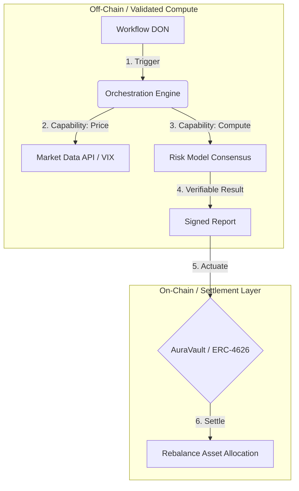

# 🏛️ AuraProtocol v2

> **Institutional-Grade RWA Orchestration & Settlement Layer.**
> *Unified liquidity orchestration powered by the Chainlink Runtime Environment (CRE).*
> *Submitted for the Chainlink Convergence 2026 Hackathon.*


## 🌐 The Convergence Thesis

Global finance is fragmented. Trillions of dollars in tokenized Real-World Assets (RWAs) are isolated on private bank chains, unable to access the deep liquidity of public markets. Manual settlement introduces T+2 latency, counterparty risk, and operational opacity.

**AuraProtocol v2 bridges this divide.** It is not just a volatility guard; it is a **Cross-Chain Orchestration Layer**. It uses the **Chainlink Runtime Environment (CRE)** to execute verifiable, compliant workflows that bridge the gap between legacy institutional systems and the public blockchain economy.

---

## 🏗️ Technical Architecture: The CRE Standard

Unlike legacy architectures that simply "connect" data, AuraProtocol v2 **orchestrates** a complete risk-management lifecycle using decentralized consensus.



### 1. The Orchestration Layer (Chainlink CRE)
We utilize the CRE as a secure middleware to abstract complexity:
- **Workflow**: A unified Go (WASM) binary that manages the entire lifecycle of risk assessment.
- **Capabilities**: Modular functions for fetching market data (VIX) and reading EVM state.
- **Consensus Computation**: Risk calculations are performed off-chain but verified by a committee of nodes before any transaction is signed.

### 2. The Settlement Layer (AuraVault)
- **Standard**: **ERC-4626** Institutional Vault.
- **Zero-Trust**: The contract strictly validates the signed reports from the CRE DON.
- **Guardrails**:
  - **Circuit Breakers**: Reverts if rebalance moves funds > 20% in one tx.
  - **Oracle Freshness**: Enforces < 3h staleness check on Chainlink Price Feeds.

---

## 🏆 Chainlink Technologies Implemented

This project demonstrates the "Effective Use of CRE" by integrating the following components:

| Technology | Implementation in AuraProtocol v2 | Prize Track Relevance |
|------------|-----------------------------------|-----------------------|
| **Chainlink Runtime (CRE)** | Orchestrates the end-to-end risk & settlement workflow using WASM. | **Core Prize / CRE** |
| **Workflow DON** | Monitors risk parameters (VIX) and triggers preemptive rebalances. | **DeFi Track** |
| **DECO / Privacy** | *(Architecture Ready)* For private institutional balance verifications. | **Risk & Compliance** |
| **Chainlink Data Feeds** | On-chain validation of asset prices before settlement. | **DeFi Track** |

---

## 🚀 Key Features

### 1. Stateless "Read-Your-Writes" Execution
The agent operates without a local database. It treats the blockchain as the single source of truth, reading the state it wrote in the previous run. This ensures **auditability** and eliminates sync errors.

### 2. Deterministic Fallback Model
To meet institutional reliability standards, the system includes a fail-safe: if the primary AI risk model is unreachable, the workflow falls back to a deterministic volatility model (`(VIX/20)*100`) to ensure 24/7 business continuity.

### 3. Regulatory-Ready Guardrails
All on-chain actions are gated by Role-Based Access Control (RBAC) and Pausable security modules, allowing for immediate intervention by a `GUARDIAN_ROLE` in case of black swan events.

---

## ⚡ Reproduction Guide (Simulation)

Judges can verify the entire workflow logic locally using the CRE CLI simulation mode.

### Prerequisites
- [Foundry](https://getfoundry.sh/)
- [Chainlink CRE CLI](https://docs.chain.link/cre)

### 1. Installation

```bash
git clone https://github.com/YourUsername/AuraProtocol.git
cd AuraProtocol
# Install smart contract dependencies
forge install
```

### 2. Run the Workflow Simulation

This command simulates the entire orchestration lifecycle: Trigger -> Capability Execution -> Consensus -> Actuation.

```bash
# Set up environment (optional for simulation)
# CRE_ETH_PRIVATE_KEY=...

# Run the simulation
cre workflow simulate . -T local --env .env
```

**Expected Output:**
```text
[USER LOG] msg="🌀 AuraProtocol v2 Agent Starting..."
[USER LOG] msg="📖 Context Loaded" prev_risk=50
[USER LOG] msg="🚀 Threshold exceeded - triggering orchestration"
[USER LOG] msg="✅ Chain write verified and executed"
```

### 3. Deploy to Testnet (Arbitrum Sepolia)

```bash
# 1. Deploy Settlement Contract
forge create contracts/AuraVault.sol:AuraVault ...

# 2. Deploy Orchestration Workflow
cre workflow deploy . --network arbitrum-sepolia
```

---

## 📜 License

This project is licensed under the MIT License.
